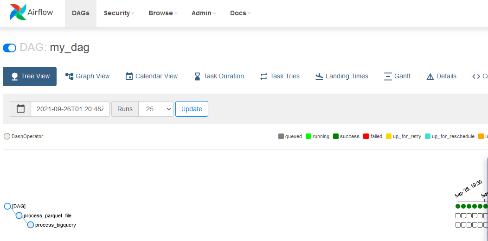

# Projeto Hackathon A3 Data - DNA

### Este repositório contém arquivos do projeto A3Data realizado pela equipe DNA composta por Isabella e Lays.

Os times devem implementar pipeline de extração, transformação e disponibilização de dados. Após extração, limpeza, organização e estruturação dos dados, as perguntas chave do desafio devem ser respondidas de maneira visual.

1. Número de indústrias ativas por mês/ano entre 2010 - 2021, discriminado por MEI 
ou Simples, em cada município brasileiro
2. Número de comércios que fecharam por mês/ano entre 2010 - 2021, discriminado 
por MEI ou Simples, em cada município brasileiro
3. Número de CNPJ novos por mês/ano entre 2010 - 2021, discriminado por MEI ou 
Simples, em cada município brasileiro
4. Qual o número de CNPJ que surgiram do grupo de educação superior, entre 2015 
e 2021, discriminado por ano, em cada estado brasileiro?
5. Qual a classe de CNAE com o maior capital social médio no Brasil no último ano?
6. Qual a média do capital social das empresas de pequeno porte por natureza 
jurídica no último ano?

## Proposta

O projeto consiste na construção de um Pipeline de dados abertos de CNPJ disponibilizados pelo governo em https://www.gov.br/receitafederal/pt-br/assuntos/orientacao-tributaria/cadastros/consultas/dados-publicos-cnpj do Ministério da Economia junto com a Receita Federal.
Desenvolvimento

A automatização do processo foi feito em Python através de arquivos .py (Python) e a esteira dos dados feita no Airflow. O armazenamento foi realizado no Bucket Cloud Storage do Google. O processamento dos dados foram feitos utilizando a biblioteca Dask em um container Docker com uma imagem do Airflow. Foram criadas tabelas no BigQuery onde foi alimentado com os dados do Bucket após tratados e convertidos para arquivos parquet para serem visualizados em Dashboad via Power BI.

O vídeo de apresentação pode ser acompanhado aqui no youtube: 2min - https://youtu.be/v8SJeva1AHs | 5 min - https://youtu.be/oFjQACs78Jk

## Etapas realizadas:

Extração dos arquivos da página do Ministério da Economia
Limpeza, tratamentos dos dados e conversão para parquet via Python
Armazenamento da base completa em formato Parquet no BigQuery, bem como criação das tabelas
Power BI para visualizção dos dados no BigQuery

## Procedimentos

Arquitetura:

As tecnologias trabalhadas nesse projeto são baseadas na Cloud da Azure:

DAG Airflow:

Airflow com os steps de processamentos de dados com o Python:

Bucket com os arquivos parquet:

Power BI - Visualização dos dados:

    

Estrutura do Bucket:

Decidimos estruturar o Bucket em 2 camadas:

A camada RAW onde fica os dados brutos baixados compactados.
A camada TRUSTED onde fica os dados brutos armazenados em Parquet.

